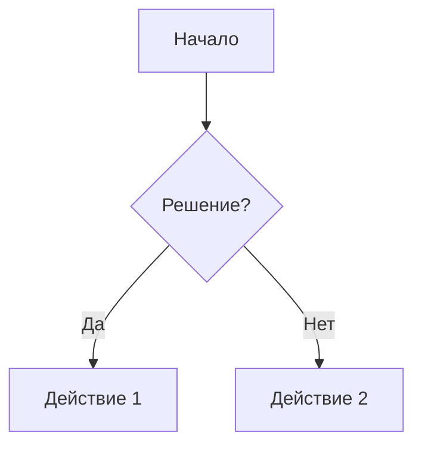

# Markdown

> Лёгкий язык разметки для форматирования текста. Основа документации в репозиториях, README, wiki.

## Зачем Markdown

- Простой и читаемый **в чистом виде**
- Поддерживается GitHub/Bitbucket/GitLab, IDE, мессенджерах
- Хранится в git — **версионируется** (в отличие от Word)

## Синтаксис — быстро

### Заголовки

```markdown
# H1 — самый большой
## H2
### H3
#### H4
```

### Выделение

```markdown
*курсив*  или  _курсив_
**жирный**  или  __жирный__
***жирный курсив***
~~зачёркнутый~~
`моноширинный (код в строке)`
```

### Списки

```markdown
- ненумерованный
- элемент
  - вложенный (2 пробела)

1. нумерованный
2. второй пункт
```

### Ссылки и картинки

```markdown
[текст ссылки](https://example.com)

```

### Код

````markdown
```python
def hello():
    print("Привет")
```
````

### Таблицы

```markdown
| Колонка 1 | Колонка 2 | Колонка 3 |
|-----------|-----------|-----------|
| А         | B         | C         |
| D         | E         | F         |
```

### Цитаты

```markdown
> Это цитата
> Продолжение цитаты
```

### Разделитель

```markdown
---
```

### Чек-лист (GitHub/Bitbucket)

```markdown
- [x] сделано
- [ ] не сделано
```

## Блок-схемы в Markdown (Mermaid)

Многие Git-хостинги поддерживают Mermaid прямо в .md:

````markdown

````

Результат — диаграмма прямо в README.

## Пример готового README

```markdown
# Название проекта

Краткое описание: что делает проект, зачем нужен.

## Установка

```bash
npm install
```

## Использование

```bash
npm start
```

## API

| Метод | Путь | Описание |
|-------|------|----------|
| GET | /api/orders | Список заказов |
| POST | /api/orders | Создать заказ |

## Лицензия
MIT
```

## Структура хорошего README

| Секция | Что писать |
|--------|-----------|
| Название + описание | Что это, зачем |
| Установка | Как поставить |
| Использование | Как запустить |
| Конфигурация | Переменные, флаги |
| API/Документация | Ссылки, таблицы |
| Contributing | Как контрибьютить (кто пишет) |
| Лицензия | Права |

## Советы

1. **Markdown для чистоты** — просто текст, без вложенности
2. **Сделайте README информативным** — это лицо проекта
3. **Используйте таблицы** — удобно для сравнений и API
4. **Проверяйте рендер** — разметка видна на хостинге
5. **Версии и лицензию** — полезно иметь

## Практическое задание

**Сценарий:** Вы пишете документацию для нового API в проекте.

**Задание:** Напишите README.md (текстом) для вымышленного API управления библиотекой. Включите:
1. Заголовок и описание проекта.
2. Секцию «Установка» с bash-кодом.
3. Таблицу API-эндпоинтов (минимум 4 строки).
4. Блок-схему процесса выдачи книги (Mermaid).
5. Чек-лист задач для следующей версии.

## Вопросы для самопроверки

1. Как сделать заголовок второго уровня?
2. Как оформить таблицу?
3. Как вставить блок кода с подсветкой?
4. Что такое Mermaid и где он работает?
5. Какие секции должны быть в хорошем README?